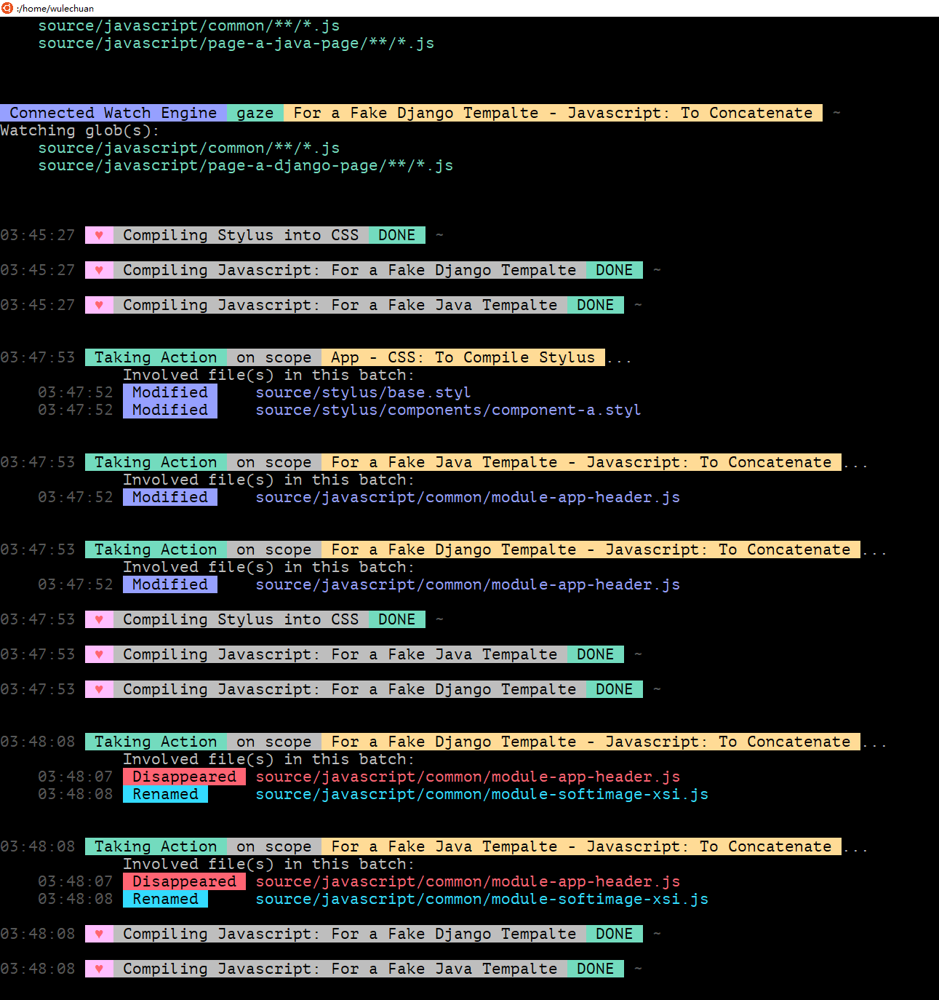

# _This ReadMe file is still under construction_


# NPM Page

<dl>
<dt>Package Name</dt>
<dd>
[@wulechuan/gulp-3-common-pipeline-presets](https://www.npmjs.com/package/@wulechuan/gulp-3-common-pipeline-presets)
</dd>
<dt>Author</dt>
<dd>南昌吴乐川</dd>
</dl>

<br/>
<br/>
<br/>
<br/>

# Introduction

This is a collection of pipeline presets for [gulp](https://gulpjs.com/).

<br/>
<br/>

# Usage

An npm script entry of this repository has been setup
to run a tryout project as a demostration.
So people can try these presets right here inside this repository
before they decide to use them elsewhere.

See below [Try It Out, See It in Action](#try-it-out-see-it-in-action).

<br/>

## Example Codes

See the `gulpfile.js` included by this repository as an example.

Below are some snippets of the said `gulpfile.js`.

### To create a pipeline for copying some files
```javascript
const gulp3CommonPipelines = require('@wulechuan/gulp-3-common-pipeline-presets');
const buildAPipelineForCopyingSomeFiles = gulp3CommonPipelines.genericPipelines.copyFiles;

const frontEndTestSitePipelineForCopyingJavaTemplates = buildAPipelineForCopyingSomeFiles({
	taskNameKeyPart: 'Java Templates (*.vm)',
	sourceBasePath: javaOrDjangoPageTemplatesPath,
	globsToCopyRelativeToSoureBasePath: [ '**/*.vm' ],
	// globsToExclude: [],
	outputBasePathOfCopying: frontEndTestSiteHTMLPath,
});
```

<br/>

### To create multiple pipelines for concatenation of some javascript source files

```javascript
const gulp3CommonPipelines = require('@wulechuan/gulp-3-common-pipeline-presets');

const buildAJavascriptBuildingPipelineForOneAppOrOnePage = gulp3CommonPipelines.specificPipelines.js.concat;


const commonSettingsAcrossMultipleJavascriptPipelines = {
	sourceBasePath: 'source/javascript',
	outputBasePathOfBuilding: '../static/js',
	shouldCopyBuiltFileToElsewhere: true,
	outputBasePathOfCopying: 'build/test-site/',
};

const buildingCommonEntryGlobsRelativeToSourceBasePath = [
	joinPath('common', '/**/*.js'),
];

const allJavascriptBuildingPipelines = [
	buildAJavascriptBuildingPipelineForOneAppOrOnePage({
		...commonSettingsAcrossMultipleJavascriptPipelines,

		taskNameKeyPart:         'For a Fake Java Tempalte',
		builtSingleFileBaseName: 'page-a-java-served-web-page',
		buildingEntryGlobsRelativeToSourceBasePath: [
			...buildingCommonEntryGlobsRelativeToSourceBasePath,
			joinPath('page-a-java-page', '/**/*.js'),
		],
	}),
	buildAJavascriptBuildingPipelineForOneAppOrOnePage({
		...commonSettingsAcrossMultipleJavascriptPipelines,

		taskNameKeyPart:         'For a Fake Django Tempalte',
		builtSingleFileBaseName: 'page-a-django-page',
		buildingEntryGlobsRelativeToSourceBasePath: [
			...buildingCommonEntryGlobsRelativeToSourceBasePath,
			joinPath('page-a-django-page', '/**/*.js'),
		],
	}),
];
```

<br/>
<br/>

## Try It Out, See It in Action

There is a dummy project included within this repository,
so that people can try this watchers controller without difficulty.

The said dummy project locates here:
```sh
<this repository root folder>/try-it-out/a-dummy-django-or-java-project
```


#### Before You Try

Before you can start trying,
you first need to install all dependencies for this npm project.

> This is a one time action, you don't need to do it
> every time before you run the tryout script.

Open a console/terminal and run:
```sh
npm install
```
or even simpler:
```sh
npm i
```

#### Run the Tryout Script

Open a console/terminal and run:
```sh
npm start
```
That's it.

<br/>
<br/>
<br/>
<br/>


### A Snapshos of Mine

Here is a snapshots of my console,
hosted within Microsoft
[Windows Subsystem for Linux (WSL)](https://docs.microsoft.com/en-us/windows/wsl/about),
running an Ubuntu instance.



<br/>
<br/>
<br/>
<br/>
